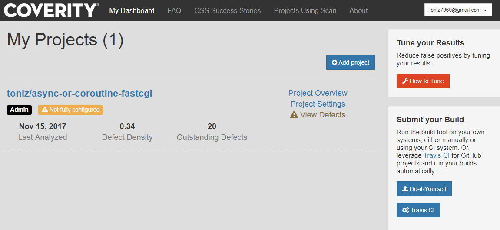
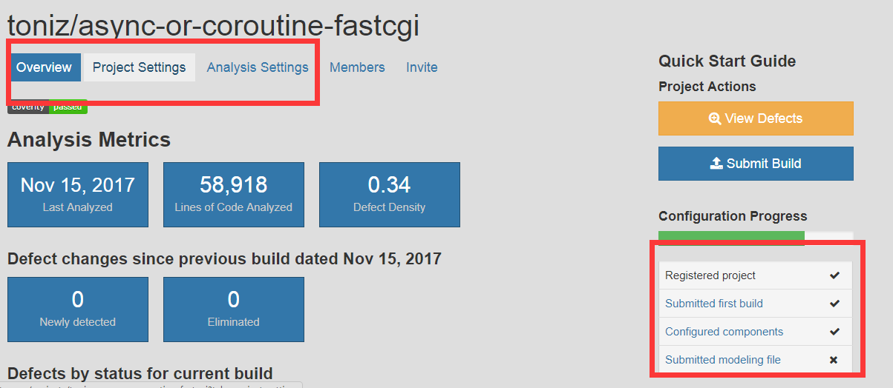
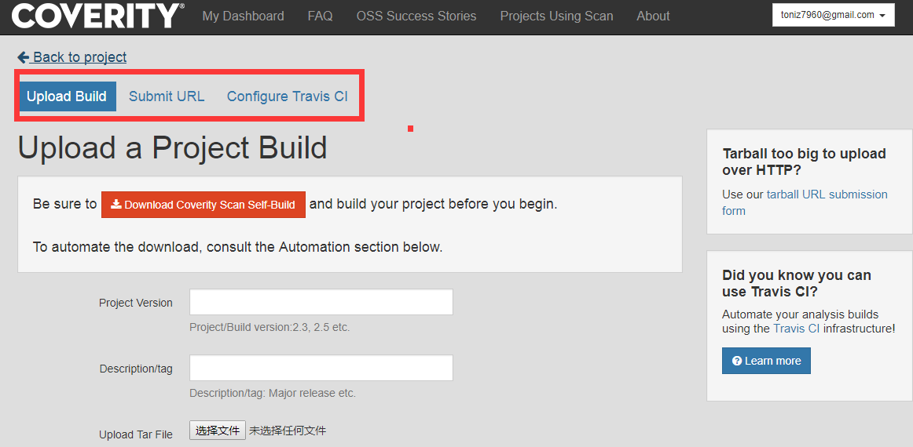
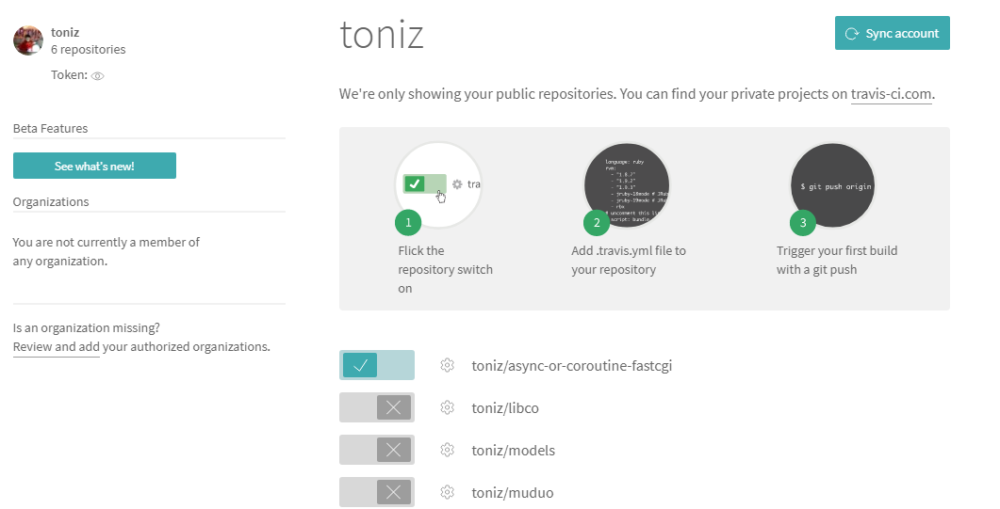

# 如何实现git上面提交源码就开始自动测试：
实现效果
[](https://scan.coverity.com/projects/toniz-async-or-coroutine-fastcgi)
点击左边图标，可以进入道测试总量页面，并且每次提交代码，都可以自动测试并在图标上反馈结果。

## 使用coverity来做免费的在线代码测试
1. 打开[coverity](https://scan.coverity.com/ "悬停显示")网站，用github账户登陆。
2. 在dashboard这个页面里，把需要实现自动测试的项目加进来。 

3. 之后进入刚添加的项目页面。注意红色的地方。

> 右边的红框表示配置的进度。现在Registered project是打勾的。

* 接下了我们配置Submitted first build。直接点击进入下面页面：

> 上面红框是上传build的模式。其实就两种模式，upload build和submit url都需要下载它的测试包，然后手工执行再上传。Travis CI就是实现自动测试代码的模式。
```sh
手工上传的我在linux下用了下面7行命令：
# 先下载安装包:
wget https://scan.coverity.com/download/linux64 --post-data "token=rCfUzcswcqW4pUxCBdABqA&project=toniz%2Fasync-or-coroutine-fastcgi" -O coverity_tool.tgz
# 解压
tar -zxvf coverity_tool.tgz
# 设置系统路径
export PATH=$PATH:/root/cov-analysis-linux64-2017.07/bin
# 切换到项目目录下
cd  ../service async-or-coroutine-fastcgi
# 执行测试程序收集数据。
cov-build --dir cov-int scons
# 用项目名命名来压缩
tar czvf async-or-coroutine-fastcgi.tgz cov-int
# 上传到coverity
curl --form token=rCfUzcswcqW4pUxCBdABqA   --form email=toniz7960@gmail.com   --form file=@async-or-coroutine-fastcgi.tgz   --form version="Version"   --form description="Description"   https://scan.coverity.com/builds?project=toniz%2Fasync-or-coroutine-fastcgi
```
做完这个。等待一下就可以看到测试结果了，不过只能看到总览的，测试详情要等两天。


可以按上面设置把结果图例添加到我们项目中。  

[](https://scan.coverity.com/projects/toniz-async-or-coroutine-fastcgi)

嗯  项目里可以看到测试结果了。接下来看看如何实现自动测试。


## 使用travis-ci.org这个网站来实现Git更新检测->自动测试->上传测试报告到coverity。
1. 用github账号登陆[travis-ci.org](https://travis-ci.org/).
> 注意travis-ci.org是免费提供给开源项目使用的。travis-ci.com是收费使用的。
2. 用github账号登陆travis-ci.org.
3. travis-ci会自动把你github上面的项目关联过来。选择要自动测试的项目打开开关。

4. 接下来是下一个.travis.yml. 先打开coverity，来到下面这个页面,把example拷贝出来。

5. 里面的环境变量和密钥不变，其它可参考我下面的.travis.yml修改。
```
language: cpp
os:
  - linux

compiler:
  - gcc

branches:
  only:
    - master

env:
  global:
    - secure: "C7smbw+mWbRYws6rKUoeGZRbK4feg+Xnfp0Owk8tLepMIGCUw/SLxPhe0rXNl1c09ABQaX9pCtXxFtz/nnfCuO55Eqdi71Il/+X6PYwMgaBOnMVWdywRgThUp7Hu2i/rK0b4ZYEQURj0HdOfIOjWY4L7v/CrnOPprwLjvrmg8CZOku2ytVmxULIrWYumbfV2KgJZs/hQaPlhcUR/eSYNVl0tz/aPEXGfUfFekuxmLWDP/z3vrIDW/hPmmWEelJVx3RTKDB+BXuNfaVfgzvoU4IV/mIG9l3FGybnQVviGZv03rJJUpaWTIsf+/CqUd6qDaesnCoiRcbkO8PwOT30GzMiPu7usu1veWhhVp9yb32nzfqITeQvzPqla74Hzjuzmyhqbi+Y1kD9rJkfS/300Z1qgb5BFjU0eblW6REuWNw4AvqgcbbqWAS5IBLVLTw+lBZNjWMl5pPlRBh3cNWKi7y1Ak2PeLgqTy03v9nlieo18PCbBFFRk2qpEiJ2bud7ptl2L/gBURvTRA6jNq5wAkCdr8xNnmeaKtbJyGuB5F9cRaz7LBRbZ36pgdO1it1Rq4kg57ooJB9cNn/ODKzZ51KPIPxkU4ODI8bvhGGZwmMKzv1kFHiAAelKaNb5TqoD4fmLp/4ukRAJo3m9QTKsWyw4NYPuGgFkT5tRucNhBSAs="

before_install:
    - echo -n | openssl s_client -connect scan.coverity.com:443 | sed -ne '/-BEGIN CERTIFICATE-/,/-END CERTIFICATE-/p' | sudo tee -a /etc/ssl/certs/ca-
    - sudo apt-get update -y
    - sudo apt-get install libboost-all-dev -y
    - sudo apt-get install aptitude -y
    - aptitude search boost -y
    - sudo apt-get install scons -y

script: if [ "${COVERITY_SCAN_BRANCH}" != 1 ]; then make ; fi

addons:
  coverity_scan:
    project:
      name: "toniz/async-or-coroutine-fastcgi"
      description: "Build submitted via Travis CI"
    notification_email: toniz7960@gmail.com
    build_command_prepend: "scons -c"
    build_command: "scons"
    branch_pattern: master
```
* before_install 第一行不变，全部都是shell指令。要安装什么模块都在这里加就行了。
* script 这句不太懂，貌似没啥用，但不加就会自动./configure & make & make test。 没弄configure文件就会挂在这里。
* build_command_prepend，build_command 填写编译语句即可。
* branches: 要选好分支，不然不会跑起来。我这里是master。
